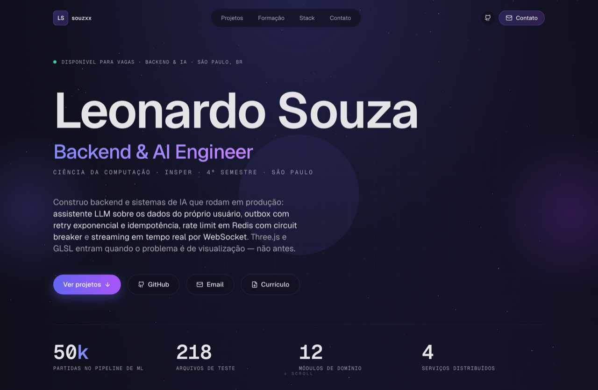

# Portfólio — Leonardo Souza

Site pessoal em Next.js 14 (App Router) + TypeScript, com os projetos, a formação e o currículo de uma página.
Produção: **https://portfolio-souzxxxs-projects.vercel.app**



## Stack e rotas

Next.js 14.2 (App Router), React 18, TypeScript, Tailwind, Framer Motion e React Three Fiber (só no fundo do hero).
Todo o conteúdo é dado tipado em `lib/`: `projects.ts`, `stack.ts`, `academic.ts`.

| Rota | O que é |
| --- | --- |
| `/` | Página única: hero, projetos em destaque, grid de projetos, formação, stack, sobre |
| `/cv` | Currículo em uma página, layout de impressão A4, `noindex`; é a fonte do PDF |
| `/opengraph-image` | Imagem OG 1200×630 gerada em runtime (`next/og`) |
| `/robots.txt`, `/sitemap.xml` | Gerados por `app/robots.ts` e `app/sitemap.ts` |

## Decisões

- **Conteúdo tipado em `lib/`, não em CMS.** O site tem um autor e nenhuma necessidade de editar sem deploy. Em troca de perder a edição fora do código, o conteúdo passa pelo compilador e pelos scripts de checagem: uma capa declarada com caminho errado quebra o build, não a página.
- **O canvas 3D do hero só monta acima de 768px e com `prefers-reduced-motion` desligado.** No build atual o chunk do `three` sai com ~670 KB minificados (~165 KB gzip), carregado à parte dos 150 KB de JS da página. Um fundo decorativo não justifica esse download no celular. Fora da viewport o `frameloop` do Canvas vira `"never"`, em vez de continuar renderizando escondido (`components/hero/ParticleField.tsx`).
- **`prebuild` roda `scripts/check-assets.ts` e falha o build** se algum `cover`, `gallery` ou `video` declarado em `lib/projects.ts` não existir em `public/`. É checagem de disco, determinística — pode travar deploy. A checagem de rede (`github` e `demo`) mora em `scripts/check-links.ts`, fora do build: roda semanalmente no workflow `.github/workflows/links.yml` e abre issue quando algo cai, porque link fora do ar não é motivo para impedir uma publicação.
- **Projeto privado não ganha botão de código.** Os cards só renderizam o link quando existe `github` e o projeto não está marcado como `isPrivate`; caso contrário aparece o rótulo "Repositório privado", sem link — em vez de um botão que leva a uma tela de login do GitHub.
- **O PDF do currículo é gerado da rota `/cv`, não mantido à parte.** `scripts/build-cv.ts` imprime a página com o Chromium e falha se o resultado passar de uma página A4 — assim o HTML e o PDF não divergem, e o limite de tamanho é verificado por script em vez de no olho.
- **Sem analytics de terceiros.** Nenhum script externo carrega no site; a única tag injetada em `app/layout.tsx` é o JSON-LD de `Person`.

## Rodando localmente

```bash
npm install
npm run dev            # http://localhost:3000
npm run build          # dispara prebuild (check:assets) antes do next build
npm run check:assets   # confere em disco os assets declarados em lib/projects.ts
npm run cv             # gera public/leonardo-souza-cv.pdf a partir de /cv
npm start              # serve o build de produção
npm run lint           # next lint
```

`npm run cv` e os scripts de screenshot usam Playwright: rode `npx playwright install chromium` uma vez.
`npm run cv` não sobe servidor — deixe `npm run dev` rodando em outro terminal (ou aponte outra origem com `CV_BASE_URL`).

## Scripts

| Arquivo | Como roda | O que faz |
| --- | --- | --- |
| `check-assets.ts` | `npm run check:assets`, e no `prebuild` | Confere que todo `cover`, `gallery` e `video` de `lib/projects.ts` existe em `public/`. Sai com erro se faltar; a ausência do PDF do currículo é só aviso. |
| `check-links.ts` | `npm run check:links` e workflow semanal | Faz GET nos links externos dos projetos (`github`, `demo`, `writeup`) e lista o status de cada um. Não entra no build. |
| `build-cv.ts` | `npm run cv` | Abre `/cv` no Chromium e imprime `public/leonardo-souza-cv.pdf` em A4; falha se o PDF sair com mais de uma página. |
| `capture.ts` | `npm run capture` | Screenshot desktop (1920×1200) e mobile (390×844) dos deploys dos projetos em `public/projects/<slug>/`. |
| `capture-financehub.ts` | `npx tsx scripts/capture-financehub.ts` | Captura as telas autenticadas do FinanceHub criando um usuário demo vazio no Supabase e apagando-o no fim, para não publicar dado pessoal. Exige `FINANCEHUB_ENV` apontando para o `.env` daquele projeto. |
| `recap-ps.ts` | `npx tsx scripts/recap-ps.ts` | Recaptura só as capas do Projeto Software. |
| `verify.ts` | `npx tsx scripts/verify.ts` | Screenshots do site local (`localhost:3000`) em `/tmp`: hero, página inteira, cada seção e mobile. |
| `verify-prod.ts` | `npx tsx scripts/verify-prod.ts` | O mesmo contra a URL de produção. |

## Deploy

Hospedado na Vercel. O build de produção é o mesmo `npm run build` daqui — com o `prebuild` na frente, um asset faltando derruba o deploy antes de publicar.
